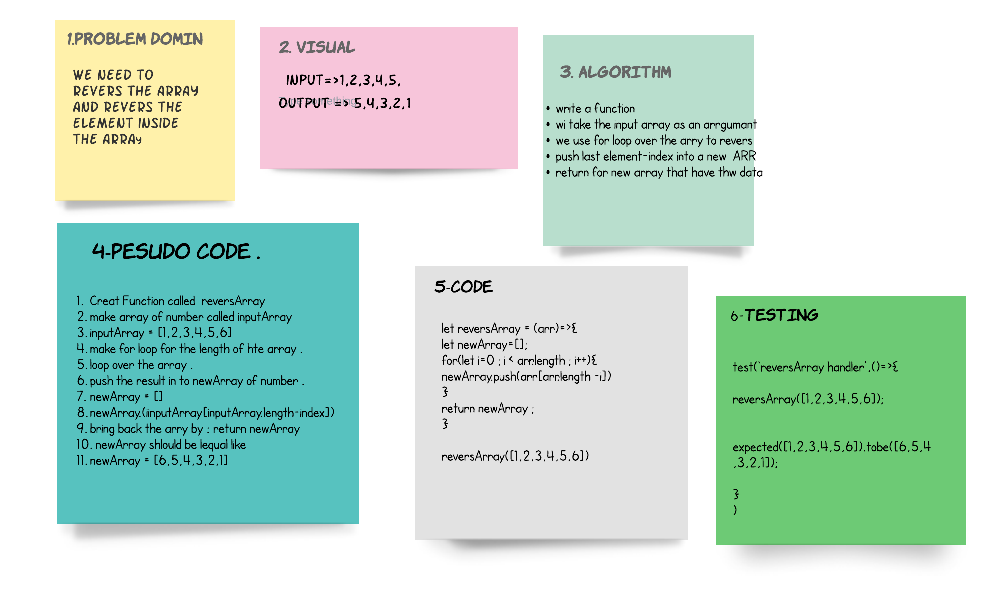

# Reverse an Array
**its make the array revers so its make it start from back to front**

## Whiteboard Process

## Approach & Efficiency
1. start to make the domin that i need and why revers .
2. code it and test to make the cade work .
3. after all it was taken almost 2 hour just to handel the whit bord .
