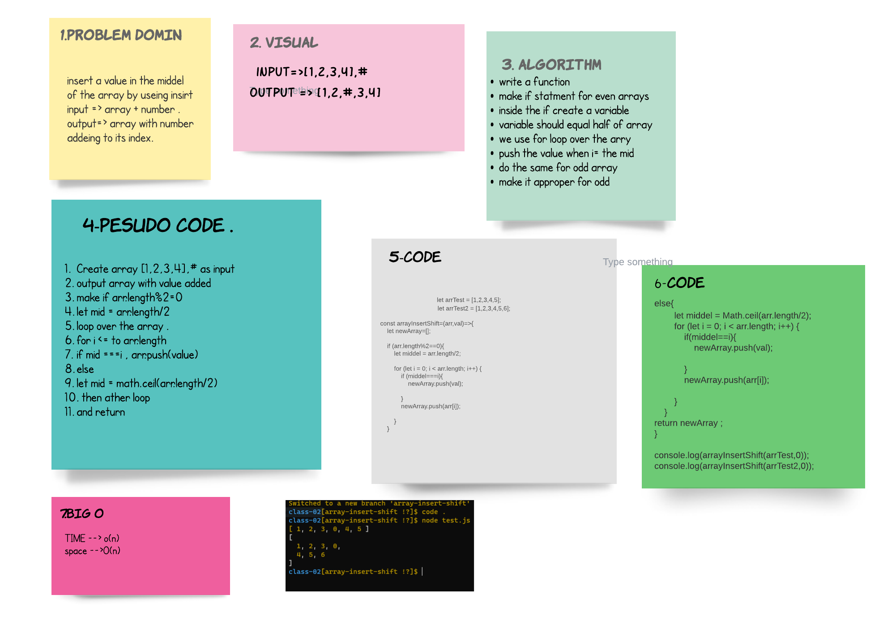

# array-insert-shift

# Insert to Middle of an Array
**it can add value to the middel of array . by make the kength of arr/2 and add the 
valur in proper plase** 

## Whiteboard Process

## Approach & Efficiency
>1. start to make the domin that i need and why revers .

>2. code it and test to make the cade work .

>3. after all it was taken almost 2 hour just to handel the whit bord .
