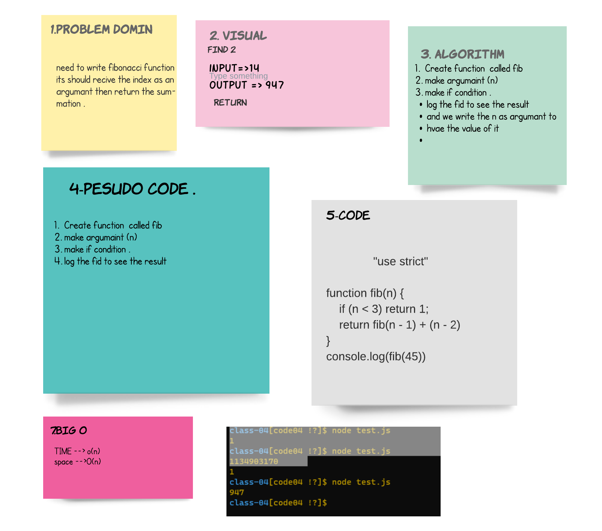

## Fibonacci Sequence
> The Fibonacci Sequence is the series of numbers:

0, 1, 1, 2, 3, 5, 8, 13, 21, 34, ...
 its adding by theorm 

## Whiteboard Process

## Approach & Efficiency
>* start to make the domin that i need and why fibonacci .
>* code it and test to make the cade work .

**after all it was taken almost 2 hour just to handel the whit bord .**