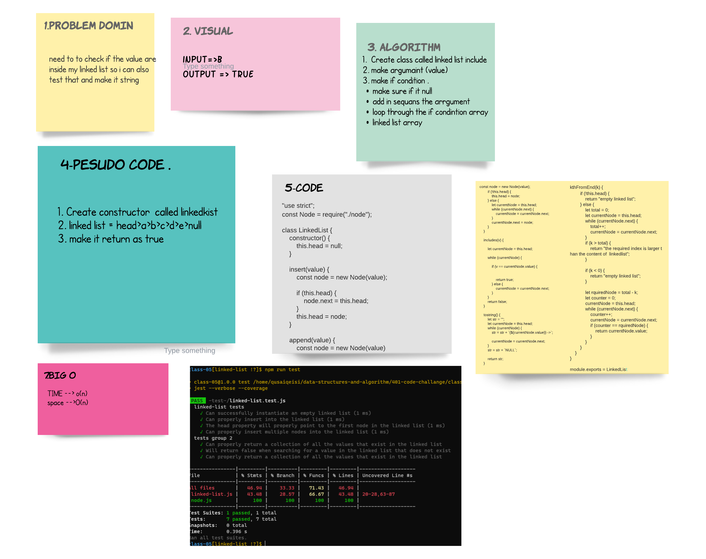

# Singly Linked List
- add node to the single linked .
- tostring the return .
- includes all checks that need for it to run .

## Challenge

## Approach & Efficiency
* start to make the domin that i need and why fibonacci .
* code it and test to make the cade work .
* after all it was taken almost 2 hour just to handel the whit bord .

