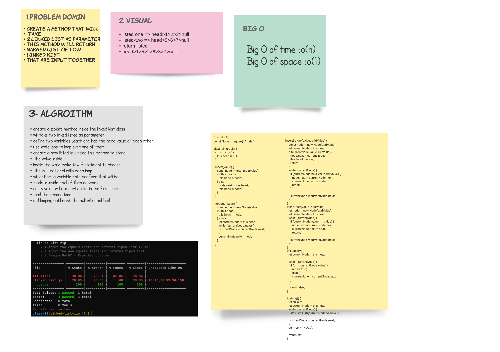

# Singly Linked List
* create zipLists method that will merge two linked lists togethor
# Challenge
* zipLists method
## Challenge

## Approach & Efficiency
* start to make the domin that i need and why fibonacci .
* code it and test to make the cade work .
* after all it was taken almost 2 hour just to handel the whit bord .