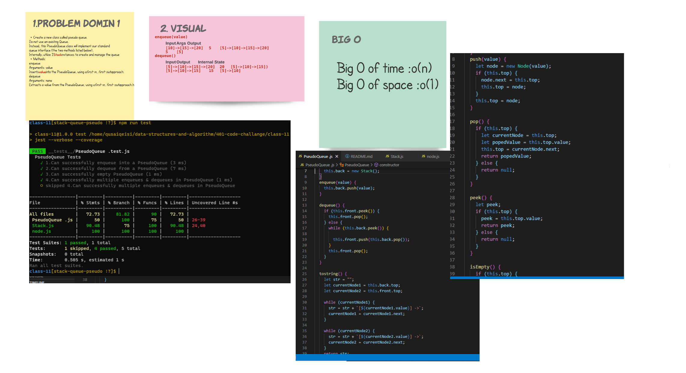

# stack-queue-pseudo

* create stack as vertical 
* creat qeueue
* stack-queue-pseudo to controll

# Challenge
* stack-queue-pseudo
## Challenge

## Approach & Efficiency
* start to make the domin that i need and why fibonacci .
* code it and test to make the cade work .
* after all it was taken almost 2 hour just to handel the whit bord .