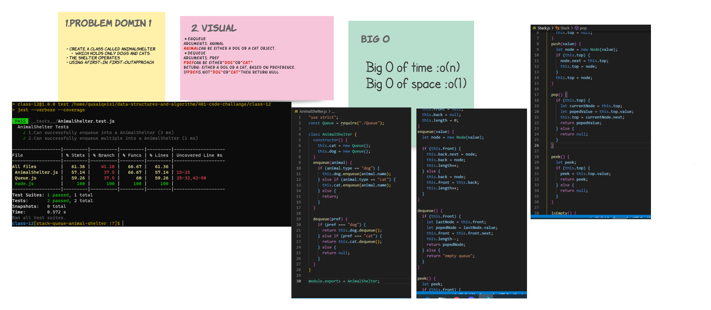

# stack-queue-animal-shelter
* using a first-in, first-out approach

## Challenge

## Approach & Efficiency
* start to make the domin that i need and why fibonacci .
* code it and test to make the cade work .
* after all it was taken almost 2 hour just to handel the whit bord .