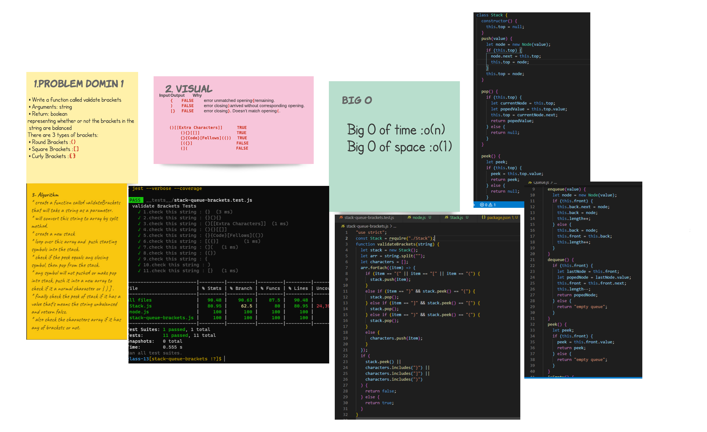

# stack-queue-brackets

## Challenge

**stack-queue-brackets**

- create a method called validate brackets that will check if the string are balanced according to brackets or not.

## Approach & Efficiency

* start to make the domin that i need and why fibonacci .
* code it and test to make the cade work .
* after all it was taken almost 2 hour just to handel the whit bord .

