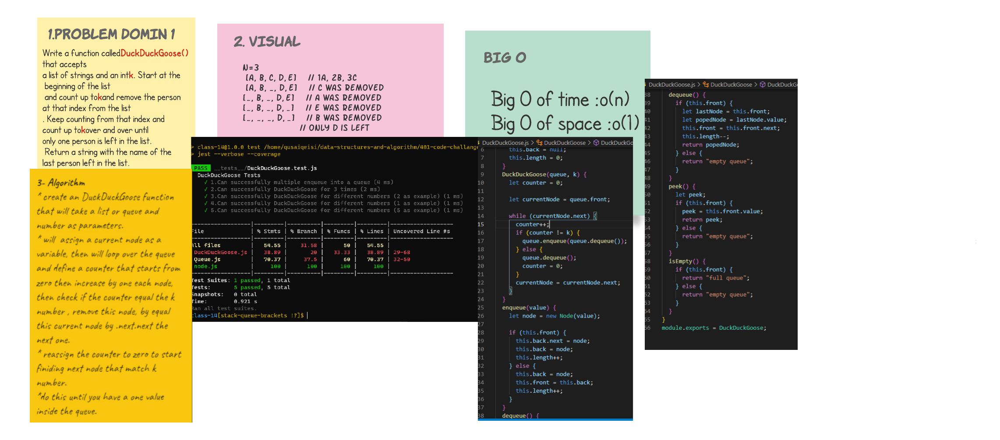

# Duck Duck Goose

## MOck interview

-  Qusai AL-Qeisi & Mayyadah Shehadeh 

## Challenge

**Duck Duck Goose**

- create a method called duckduckgoose that recieves a queue and a number and will count elements by this number starting from the first element. each element will match its position this number will be deleted.

- will delete all elements except the final one.
- ues stack and queue that you can see the full code at my repo 

## Approach & Efficiency
- start to make the domin that i need and why fibonacci .
- code it and test to make the cade work .
- after all it was taken almost 2 hour just to handel the whit bord .
<!-- What approach did you take? Why? What is the Big O space/time for this approach? -->

<!--  -->