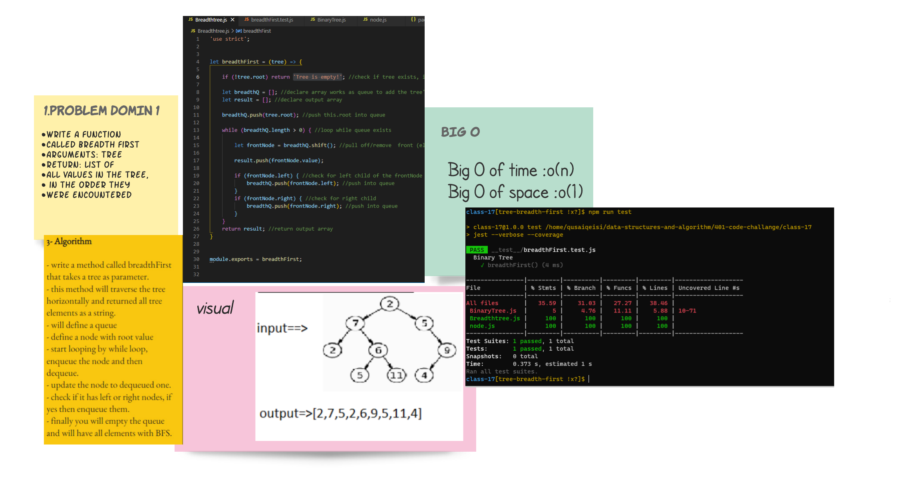

# Binary Tree : Breadth-first Traversal.

## Challenge 17

## tree-breadth-first :
- Node Create a Node class that has properties for the value stored in the node, the left child node, and the right child node. Binary Tree Create a Binary Tree class Define a method for each of the depth first traversals: pre order in order post order which returns an array of the values, ordered appropriately. Any exceptions or errors that come from your code should be semantic, capture-able errors. For example, rather than a default error thrown by your language, your code should raise/throw a custom, semantic error that describes what went wrong in calling the methods you wrote for this lab.
- create a method in the binary tree class called **breadthFirst** that traverse the tree horizontally.

   

## Approach & Efficiency
- start to make the domin that i need and why fibonacci .
- code it and test to make the cade work .
- after all it was taken almost 2 hour just to handel the whit bord .
## Whiteboard

<!--  -->

## API
