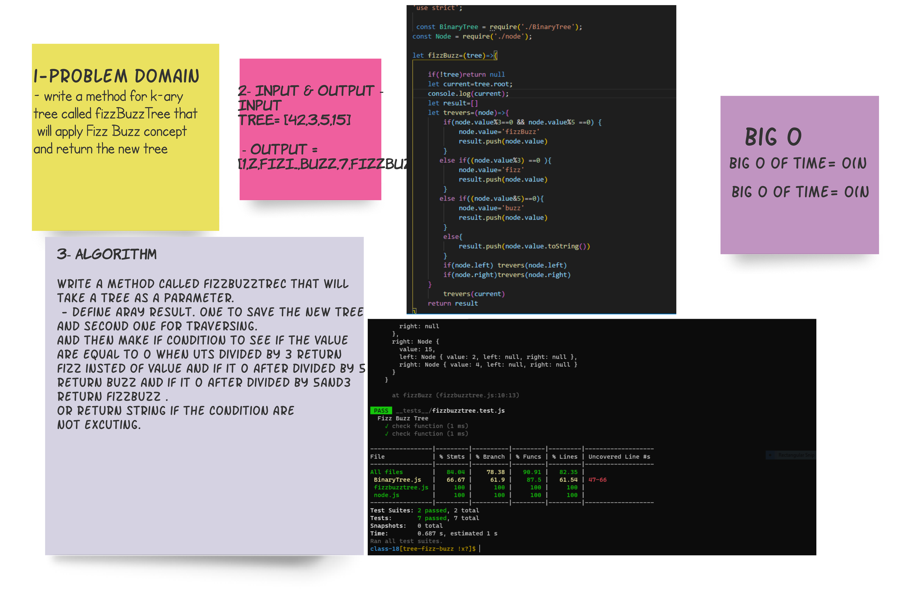

## tree-fizz-buzz :

create a method in the binary tree class called fizzBuzztree that replace each number divided by 3 with 'Fizz' word, and if it divided by 5 will replaced by 'Buzz', and for 5 and 3 togethor replace with "FizzBuzz". and return the new tree.

## Whiteboard

