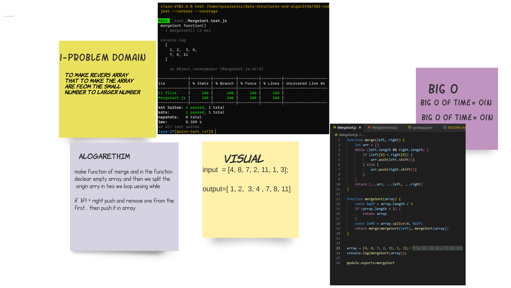

# Challenge Summary
## MergeSort

> the “divide and conquer” concept. Given an array, we first divide it in the middle and we get 2 arrays. We recursively perform this operation, until we get to arrays of 1 element

## Whiteboard Process

## Approach & Efficiency
<!-- What approach did you take? Why? What is the Big O space/time for this approach? -->

## Solution
