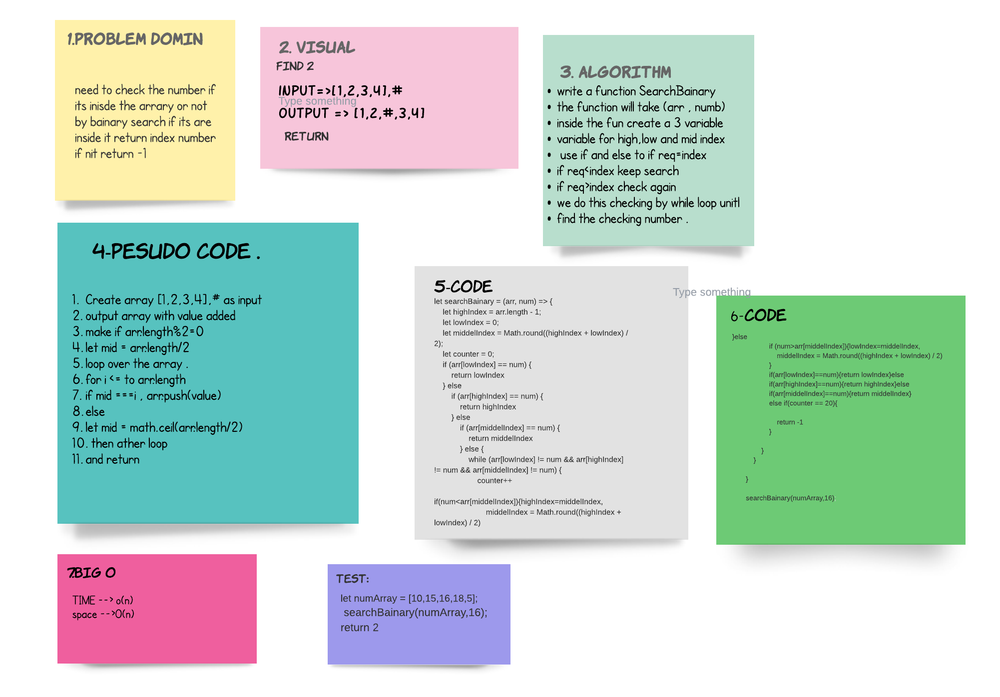

# Binary Search of Sorted Array
its by doing search to the nuber that we need and when we find it we give it as number of index .

## Whiteboard Process

## Approach & Efficiency
>1. start to make the domin that i need and why revers .
>2. code it and test to make the cade work .

**after all it was taken almost 2 hour just to handel the whit bord .**